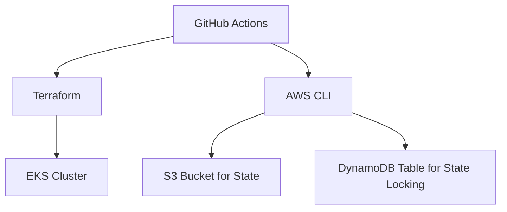
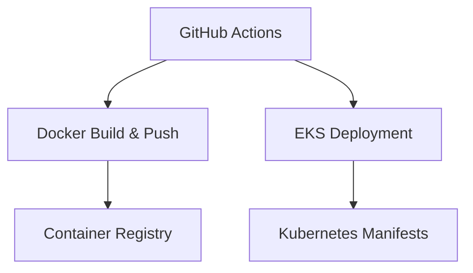

## DevOps/MLOps Template for AWS
This repository is a template and demo for DevOps/MLOps on AWS using GitHub Actions and Terraform. It includes workflows for CI/CD, infrastructure provisioning, and deployment of applications to Kubernetes clusters.

### Provisioning AWS Resources with Terraform
Initiate the [terraform.yaml](.github/workflows/terraform.yaml) GitHub actions workflow to provision AWS resources using Terraform. This workflow can be triggered manually from the GitHub website. This workflow will:
- Create an S3 bucket for storing Terraform state.
- Create a DynamoDB table for state locking.
- Create an EKS cluster with a node group.



### App Deployment
Github Actions is used to deploy applications to an EKS cluster. The workflow will:
- Build and push Docker image to this repository's container registry.
- Deploy the application to the EKS cluster using the provided Kubernetes manifests.



### Required GitHub Secrets
- `TF_STATE_BUCKET`: Name of the S3 bucket for Terraform state.
- `TF_STATE_TABLE`: Name of the DynamoDB table for state locking.
- `AWS_ACCESS_KEY_ID`: AWS access key ID.
- `AWS_SECRET_ACCESS_KEY`: AWS secret access key.
- `KUBECONFIG`: Base64 encoded kubeconfig file for accessing the EKS cluster.

Generate kubeconfig using the following command once the EKS cluster is created:
```bash
aws eks update-kubeconfig --name <EKS_CLUSTER_NAME> --region <AWS_REGION> --profile <AWS_PROFILE>
```

Then encode it to base64:
```

### Required GitHub Variables
- `AWS_REGION`: The AWS region where resources will be created (e.g., `us-east-1`).
- `EKS_CLUSTER_NAME`: The name of the EKS cluster to be created.


AWS IAM permissions for Terraform backend described here:  https://developer.hashicorp.com/terraform/language/backend/s3